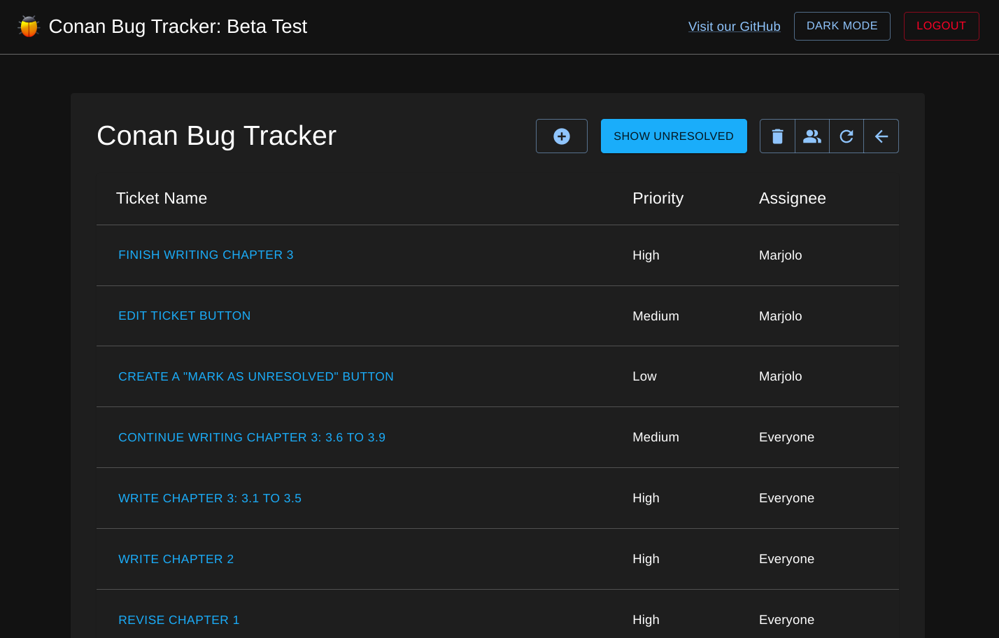
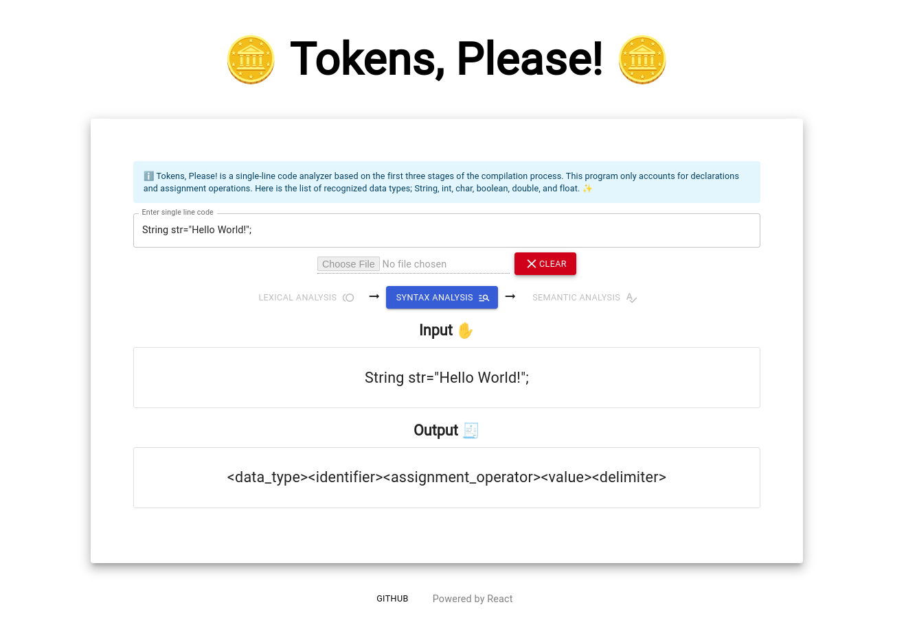
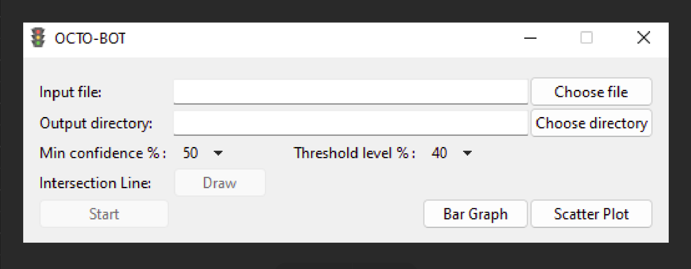
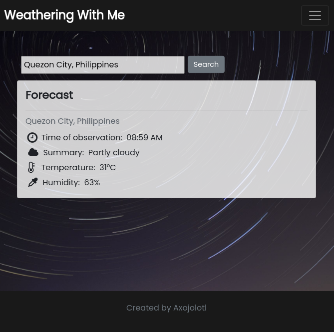
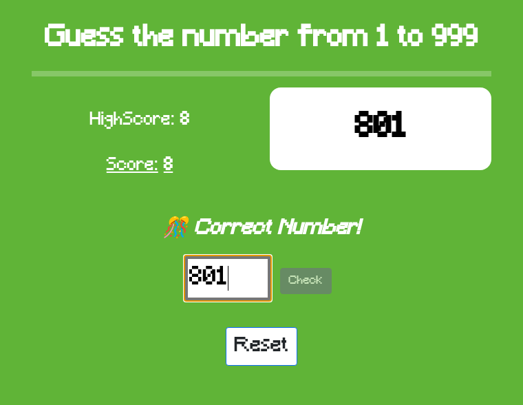
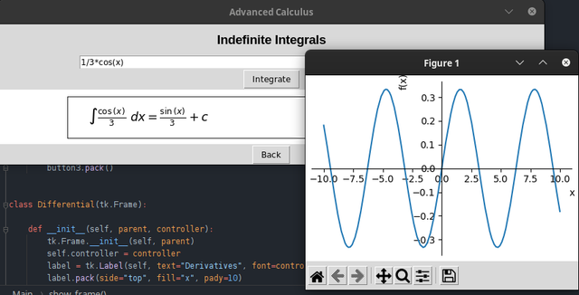
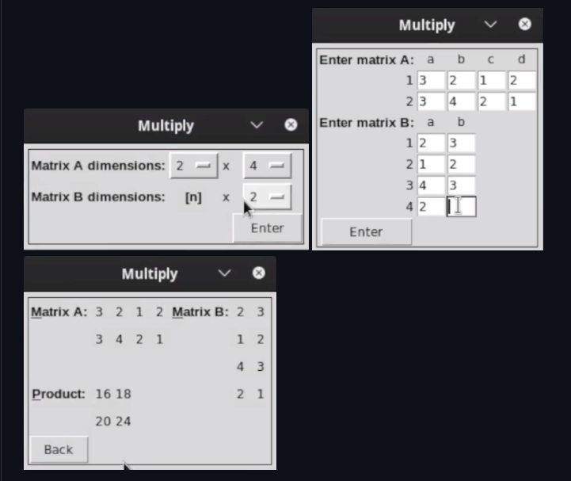

I'll be dumping my projects in this page.

## Conan

Mar 2023 - Apr 2023

Built and designed a web-based user-friendly Bug Tracker designed to help students in the CICS get started with bug tracking.
Used React, Material UI, and Firebase

GitHub: https://github.com/mlmabuti/conan-bug-tracker

## Tokens, Please!

Nov 2022 - Dec 2022

Designed and devleoped a React web application to demonstrate the
first three phases of the compilation process. This project
includes a tokenizer, parser, and a semantic analyzer.

GitHub: https://github.com/mlmabuti/tokens-please

## OCTO

Mar 2022 - Apr 2022

Developed a minimalist GUI using Tkinter for a Python image
processing bot. Applied best software design principles and
wrote a comprehensive code documentation.

GitHub: https://github.com/aj-tap/OCTO

## Weathering with Me

Feb 2022 - Feb 2022

Developed a weather forecasting application using Express.js. Designed with
Bootstrap Studio. A concept project.

GitHub: https://github.com/mlmabuti/weathering-with-me/

## Guess the Number Game

Jan 2022 - Jan 2022

Developed a basic guessing game web application using vanilla JavaScript.
Designed with Bootstrap Studio. A concept project.

GitHub: https://github.com/mlmabuti/guess-the-number-game

## Intergral Calculator

Nov 2021 - Dec 2021

Developed a desktop calculator with Python to calculate the
derivative and anti-derivatives in Latex along with a graph of the
results.

GitHub: https://github.com/mlmabuti/integral-calculator

## Matrix Calculator

Nov 2021 - Nov 2021

Developed a desktop matrix calculator with Python to determine
the sum, transpose, inverse, or product of two matrices.

GitHub: https://github.com/mlmabuti/matrix-calculator
